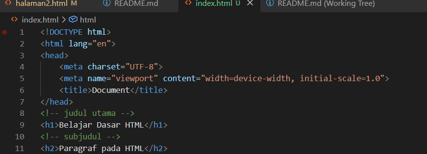
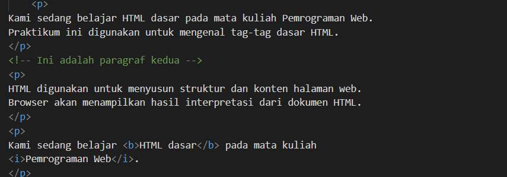
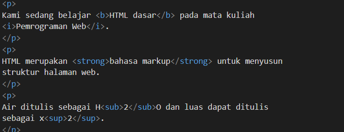
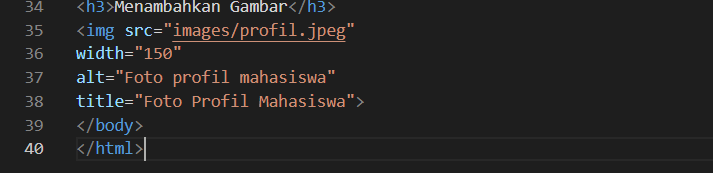
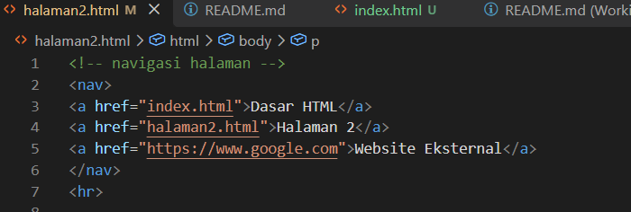
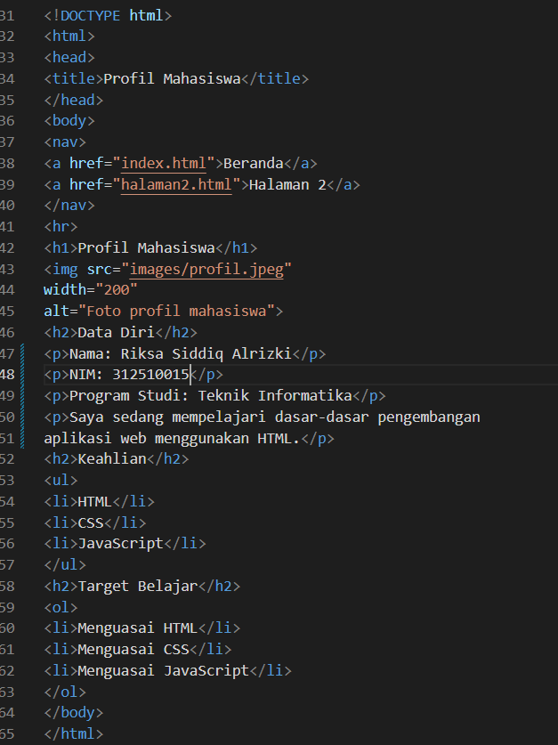

Nama:Riksa Siddiq Alrizki
NIM:312510015
Kelas:I253A
Matakuliah:Pemrograman Web


# Penjelasan Kode HTML — Belajar Dasar HTML

Dokumen ini menjelaskan struktur dan fungsi setiap bagian dari kode HTML pada praktikum Pemrograman Web.

## 1. Struktur Dasar Dokumen

```html
<!DOCTYPE html>
<html>
<head>
<title>index</title>
</head>
<body>
</body>
</html>
```

- `<!DOCTYPE html>` — mendeklarasikan bahwa dokumen ini menggunakan HTML5.
- `<html>` — elemen root yang membungkus seluruh isi halaman.
- `<head>` — berisi informasi tentang dokumen yang tidak ditampilkan langsung di halaman, seperti judul tab browser.
- `<title>index</title>` — menentukan judul yang muncul pada tab browser, yaitu "index".
- `<body>` — bagian yang berisi seluruh konten yang akan ditampilkan di halaman web.

## 2. Judul dan Subjudul

```html
<h1>Belajar Dasar HTML</h1>
<h2>Paragraf pada HTML</h2>
```

- `<h1>` sampai `<h6>` adalah tag heading (judul), dengan `<h1>` sebagai judul terbesar/utama dan semakin besar angkanya semakin kecil ukurannya.
- Di sini `<h1>` digunakan sebagai judul utama halaman, dan `<h2>` sebagai subjudul.
**Screenshot Hasil:**  

## 3. Paragraf

```html
<p>
Kami sedang belajar HTML dasar pada mata kuliah Pemrograman Web.
Praktikum ini digunakan untuk mengenal tag-tag dasar HTML.
</p>
```

- Tag `<p>` digunakan untuk membuat paragraf teks biasa. Setiap `<p>` baru otomatis dimulai pada baris baru dengan jarak (margin) di atas dan bawahnya.
**Screenshot Hasil:**  

## 4. Format Teks (Bold, Italic, Strong)

```html
<p>
Kami sedang belajar <b>HTML dasar</b> pada mata kuliah
<i>Pemrograman Web</i>.
</p>
<p>
HTML merupakan <strong>bahasa markup</strong> untuk menyusun
struktur halaman web.
</p>
```

- `<b>` — menebalkan teks secara visual saja (tanpa makna semantik khusus).
- `<i>` — memiringkan teks secara visual saja.
- `<strong>` — menebalkan teks dan sekaligus menandakan bahwa teks tersebut penting secara semantik (lebih disarankan daripada `<b>`).

## 5. Subscript dan Superscript

```html
<p>
Air ditulis sebagai H<sub>2</sub>O dan luas dapat ditulis
sebagai x<sup>2</sup>.
</p>
```

- `<sub>` — menampilkan teks sebagai subscript (turun di bawah baris teks), cocok untuk rumus kimia seperti H₂O.
- `<sup>` — menampilkan teks sebagai superscript (naik di atas baris teks), cocok untuk pangkat seperti x².
**Screenshot Hasil:**  

## 6. Menambahkan Gambar

```html
<h3>Menambahkan Gambar</h3>

```

- `<h3>` — heading level 3, digunakan sebagai sub-subjudul untuk bagian gambar.
- `` — tag untuk menampilkan gambar, dan tidak memiliki tag penutup.
- `src` — lokasi/path file gambar yang akan ditampilkan (di sini `images/profil.jpeg`).
- `width` — mengatur lebar gambar dalam piksel (200px).
- `alt` — teks alternatif yang muncul jika gambar gagal dimuat, juga penting untuk aksesibilitas (pembaca layar).
- `title` — teks tooltip yang muncul saat kursor diarahkan ke gambar.
**Screenshot Hasil:**  

## 7. Komentar HTML

```html
<!-- navigasi halaman -->
```

- Ditulis dengan `<!-- ... -->` dan tidak ditampilkan oleh browser. Digunakan untuk memberi catatan pada kode, misalnya menandai awal suatu bagian (section) agar kode lebih mudah dibaca.

## 8. Navigasi (`<nav>` dan `<a>`)

```html
<nav>
<a href="index.html">Dasar HTML</a>
<a href="halaman2.html">Halaman 2</a>
<a href="https://www.google.com">Website Eksternal</a>
</nav>
```

- `<nav>` — menandai bagian halaman yang berisi kumpulan tautan navigasi.
- `<a href="...">` — tag hyperlink (tautan). Atribut `href` menentukan tujuan tautan.
  - Tautan ke `index.html` dan `halaman2.html` adalah tautan **internal** (menuju halaman lain dalam situs yang sama).
  - Tautan ke `https://www.google.com` adalah tautan **eksternal** (menuju situs lain di internet).
**Screenshot Hasil:**  

## 9. Garis Pemisah

```html
<hr>
```

- `<hr>` — menampilkan garis horizontal sebagai pemisah antar bagian konten. Tidak memiliki tag penutup.

## 10. List Tidak Berurutan dan Berurutan

```html
<ul>
<li>HTML</li>
<li>CSS</li>
<li>JavaScript</li>
</ul>

<ol>
<li>Mempelajari struktur HTML</li>
<li>Mempelajari tag dan atribut</li>
</ol>
```

- `<ul>` (unordered list) — daftar tidak berurutan, ditampilkan dengan tanda bullet (•). Cocok untuk daftar yang urutannya tidak penting, seperti daftar keahlian.
- `<ol>` (ordered list) — daftar berurutan, ditampilkan dengan penomoran (1, 2, 3, ...). Cocok untuk daftar yang urutannya penting, seperti tahapan belajar.
- `<li>` (list item) — setiap item di dalam `<ul>` atau `<ol>`.

## 11. Dokumen Kedua: Halaman Profil Mahasiswa

Bagian ini adalah dokumen HTML lengkap dan terpisah (`Profil Mahasiswa`), menggabungkan semua elemen yang sudah dijelaskan di atas menjadi satu halaman utuh:

- **`<head><title>Profil Mahasiswa</title></head>`** — judul tab browser untuk halaman ini.
- **`<nav>`** — menu navigasi berisi tautan ke "Beranda" (index.html) dan "Halaman 2".
- **`<hr>`** — pemisah antara navigasi dan konten utama.
- **`<h1>Profil Mahasiswa</h1>`** — judul utama halaman.
- **``** — menampilkan foto profil mahasiswa dengan lebar 200px.
- **`<h2>Data Diri</h2>`** diikuti tiga `<p>`** — menampilkan data diri (nama, NIM, program studi) masing-masing dalam paragraf terpisah, serta satu paragraf deskripsi singkat.
- **`<h2>Keahlian</h2>` + `<ul>`** — daftar keahlian (HTML, CSS, JavaScript) sebagai list tidak berurutan karena urutannya tidak penting.
- **`<h2>Target Belajar</h2>` + `<ol>`** — daftar target belajar sebagai list berurutan karena mencerminkan tahapan/urutan pencapaian yang ingin dicapai.

Struktur ini menunjukkan bagaimana elemen-elemen dasar (heading, paragraf, gambar, list, navigasi) digabungkan untuk membentuk satu halaman web yang utuh dan terstruktur.
**Screenshot Hasil:**  

## Ringkasan

Kode ini mendemonstrasikan elemen-elemen dasar HTML: struktur dokumen (`html`, `head`, `body`), heading (`h1`–`h3`), paragraf (`p`), format teks (`b`, `i`, `strong`, `sub`, `sup`), penyisipan gambar (`img`), komentar (`<!-- -->`), navigasi dan tautan (`nav`, `a`), garis pemisah (`hr`), serta list berurutan dan tidak berurutan (`ol`, `ul`, `li`) — yang kemudian digabungkan menjadi halaman profil mahasiswa yang utuh.


10 latihan soal

1. Apa fungsi deklarasi <!DOCTYPE html> pada dokumen HTML?
Deklarasi <!DOCTYPE html> berfungsi untuk menyatakan bahwa dokumen menggunakan standar HTML5. Dengan adanya deklarasi ini, browser dapat menampilkan dan memproses halaman web sesuai dengan standar HTML5.

2. Apa perbedaan antara tag, elemen, dan atribut pada HTML?

Tag adalah penanda yang ditulis menggunakan tanda kurung siku (< >), seperti <p>, <h1>, dan .
Elemen adalah keseluruhan bagian HTML yang terdiri dari tag pembuka, isi, dan tag penutup (atau tag tunggal untuk elemen tertentu).
Atribut adalah informasi tambahan yang ditulis pada tag pembuka untuk memberikan fungsi atau keterangan tertentu, misalnya href, src, alt, dan width.

3. Apa perbedaan <p> dengan <br>? Jelaskan penggunaannya.

Tag <p> digunakan untuk membuat paragraf baru sehingga teks tersusun menjadi beberapa paragraf.
Tag <br> digunakan untuk berpindah ke baris baru tanpa membuat paragraf baru.
Dengan demikian, <p> digunakan untuk memisahkan isi menjadi paragraf, sedangkan <br> hanya digunakan untuk memindahkan teks ke baris berikutnya.

4. Apa fungsi atribut href pada tag <a>?
Atribut href berfungsi untuk menentukan alamat atau tujuan hyperlink yang akan dibuka ketika link diklik, baik menuju halaman lain, website lain, maupun bagian tertentu dalam halaman yang sama.

5. Apa perbedaan hyperlink ke halaman internal dengan hyperlink ke website eksternal?

Hyperlink internal menghubungkan ke halaman lain yang masih berada dalam website atau folder proyek yang sama, misalnya halaman2.html.
Hyperlink eksternal menghubungkan ke website lain di luar website yang dibuat, misalnya https://www.google.com.

6. Apa fungsi atribut src dan alt pada tag ?

src berfungsi untuk menentukan lokasi atau path file gambar yang akan ditampilkan.
alt berfungsi memberikan teks alternatif atau deskripsi gambar yang akan ditampilkan apabila gambar tidak dapat dimuat atau untuk membantu aksesibilitas.

7. Apa perbedaan penggunaan <ul> dan <ol>?

<ul> (Unordered List) digunakan untuk membuat daftar yang tidak menggunakan nomor atau urutan.
<ol> (Ordered List) digunakan untuk membuat daftar yang menggunakan nomor atau urutan tertentu.

8. Apa yang terjadi jika path gambar pada atribut src salah?
Jika path atau lokasi gambar pada atribut src salah, maka browser tidak dapat menemukan dan menampilkan gambar. Sebagai gantinya, browser akan menampilkan teks yang terdapat pada atribut alt jika atribut tersebut tersedia.

9. Mengapa struktur heading h1 sampai h6 perlu digunakan secara terstruktur?
Karena heading berfungsi sebagai judul dan subjudul halaman. Penggunaan h1 hingga h6 secara berurutan membuat struktur dokumen menjadi lebih rapi, mudah dipahami, dan menunjukkan hierarki informasi dari judul utama hingga subjudul.

10. Apa fungsi komentar <!-- ... --> dalam kode HTML?
Komentar HTML berfungsi untuk memberikan penjelasan atau catatan pada kode program, menandai bagian tertentu, serta dapat digunakan untuk menonaktifkan kode sementara. Komentar hanya dapat dilihat oleh programmer dan tidak akan ditampilkan pada halaman web di browser
